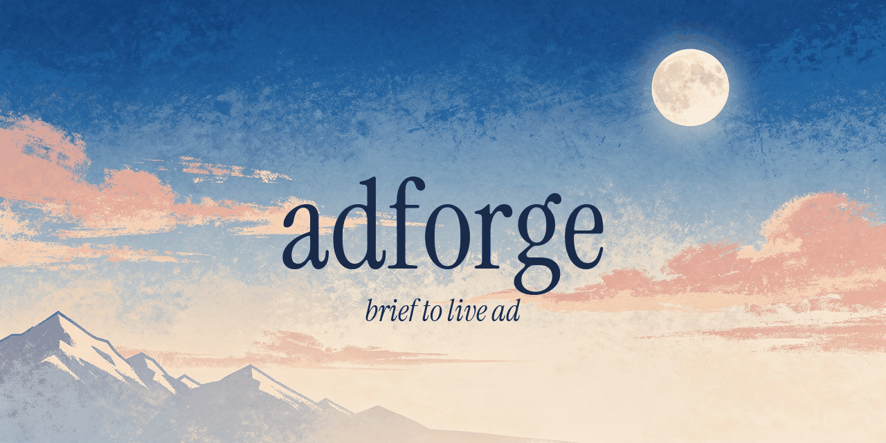

<p align="center">
  
</p>

# adforge

> Brief-to-live-ad pipeline for Meta. Runs inside your agent (Claude Code, Codex, Cursor).

adforge turns a one-line brief into rendered creatives and, with approval, live Meta ads. It's an opinionated pipeline, not a framework — PIL + Remotion for rendering, a small idempotent Meta adapter for deploy, and markdown skills that orchestrate the agent you already use.

## Prerequisites

adforge degrades gracefully — you can start without any keys and still render creatives locally. Here's what unlocks what:

**Runtime (required):**
- Node 18+
- Python 3 with Pillow (`pip install Pillow`)
- ffmpeg (for motion renders)

**Meta deploy keys (optional — unlock live ads):**

| Key | What it unlocks | How to get it |
|-----|-----------------|---------------|
| `META_ACCESS_TOKEN` | Deploy to Meta, review performance, pause/scale ads | [Meta Business → System User token](https://developers.facebook.com/docs/marketing-api/system-users) with `ads_management` + `pages_read_engagement` scopes |
| `META_AD_ACCOUNT_ID` | Same as above — target account | Ads Manager → Account Settings (format: `act_1234...`) |
| `META_PAGE_ID` | Page to run ads from | Your FB page → About → Page ID |
| `META_PIXEL_ID` *(optional)* | Conversion-optimized campaigns | Events Manager → Data Sources → Pixel ID |

**Image-generation keys (optional — any *one* unlocks AI heroes):**

adforge is provider-neutral. Drop any one of the keys below into `.env` and generation works end-to-end. Auto-detection order is BFL → Google → OpenAI → Replicate → Stability → fal; force a specific provider with `IMAGE_PROVIDER=<name>`, swap the default model per provider via `<PROVIDER>_MODEL`.

| Key | Provider | Default model | Get a key |
|-----|----------|---------------|-----------|
| `BFL_API_KEY` | Black Forest Labs (FLUX) | `flux-2-pro` | [dashboard.bfl.ai/keys](https://dashboard.bfl.ai/keys) |
| `GEMINI_API_KEY` | Google Gemini / Nano Banana | `gemini-2.5-flash-image` | [aistudio.google.com/apikey](https://aistudio.google.com/apikey) |
| `OPENAI_API_KEY` | OpenAI Images | `gpt-image-1` | [platform.openai.com/api-keys](https://platform.openai.com/api-keys) |
| `REPLICATE_API_TOKEN` | Replicate | `google/nano-banana-2` | [replicate.com/account/api-tokens](https://replicate.com/account/api-tokens) |
| `STABILITY_API_KEY` | Stability AI | `stable-image-core` | [platform.stability.ai/account/keys](https://platform.stability.ai/account/keys) |
| `FAL_KEY` | fal.ai | `fal-ai/flux/schnell` | [fal.ai/dashboard/keys](https://fal.ai/dashboard/keys) |

Bringing a provider not on this list (Mistral, Ideogram, Azure OpenAI, Bedrock, Cloudflare Workers AI, a self-hosted Comfy endpoint, …)? Ask the agent to run `image-provider-synth` — it reads the provider's official docs and writes a new adapter under `engines/static/image_providers/<name>.py` that the dispatcher picks up automatically.

**Without any image-generation key:** creatives still render — set `hero_mode: "flat_brand_color"` in variants. Fine for MVP.

**Without any keys at all:** you can still scaffold, render static + motion creatives, and iterate locally. You just can't deploy to Meta or auto-generate heroes inside the pipeline.

## Install

```bash
npx adforge init my-ads
cd my-ads
cp .env.example .env        # fill in keys
```

Then open the project in your agent of choice:

```bash
claude                      # Claude Code → /adforge
codex                       # Codex CLI   → "start adforge"
cursor .                    # Cursor      → "start adforge"
```

The agent reads `.claude/skills/adforge/SKILL.md` (or `AGENTS.md` for Codex) and runs the hub.

## What you get

- **4 user modes** — new-campaign, add-creative, review-performance, setup
- **Examples, not templates** — static example layouts (advertorial / stat-card / quote-card) and motion example compositions (ops-console / product-mockup / walkthrough / phone-notifications) sit in `engines/static/examples/` and `engines/motion/src/examples/`. They're reference implementations — show the agent a reference creative or describe what you want and `layout-synth` / `motion-synth` drafts a new module on the spot. Auto-registered as soon as the file lands.
- **Motion primitives** — `engines/motion/src/primitives/` owns the motion vocabulary (Kicker, Headline, Cursor+ClickRipple, Ticker, TypewriterField, ChromeOverlay). Compositions assemble from primitives instead of re-implementing them, so new compositions stay structurally distinct from existing ones.
- **Opt-in brand chrome** — by default, every creative is a naked canvas. If you want a wordmark or logo on every ad, declare it once in `brand.json → chrome.wordmark` (text or image, any of 6 corner positions). Two brands running the same layout won't produce ads that look identical unless both opt in to the same chrome.
- **Bring your own creative** — if you already have finished PNGs/MP4s, skip compose entirely; `deploy.py` takes any asset path.
- **Meta adapter** — deploy, review, actions (pause / resume / scale / delete), idempotent by name via `.adforge/state.json`
- **Brand tokens** — one `brand.json` drives both Python and Remotion
- **Fonts handled during setup** — agent reads your website's font-family, auto-downloads matching Google Fonts into `./fonts/`, or falls back to a sane default trio. TTFs feed both engines; missing files fall back to PIL default / CSS generic instead of crashing.
- **Agent-portable** — plain markdown skills. No runtime you have to trust.

## Try this

adforge doesn't ship a fixed catalog of ad types. The example layouts and compositions are starting points — the agent synthesizes new ones on the spot. A few things people have done that the stock examples don't cover:

- **"Turn my app screenshots into a product walkthrough."** Drop a few PNGs into `assets/`, describe the order, get a motion ad that pans across screens with on-brand captions. No Figma, no After Effects.
- **"A founder quote with my photo, background removed, and a speech bubble saying X."** Agent removes the background ad-hoc (rembg, Photoshop, whatever), drafts a new `founder-quote` layout, renders 4x5 + 9x16 in one pass.
- **"Match this competitor ad but in my brand."** Paste a screenshot. The `layout-synth` skill reads the structure, writes a new layout module, and renders it against your `brand.json` — colors, fonts, voice, all yours.

None of these are hardcoded features. They're what falls out of: a registry that auto-discovers new example modules + motion primitives the agent assembles from + ad-hoc asset prep (rembg, Flux, Photoshop, whatever). If you can describe it, it's usually a 2-minute synth loop away.

## Why it exists

Running ads manually is tedious: assembling creatives in Canva or Figma, writing copy from scratch, keeping every variant on brand, uploading to Ads Manager one by one, and then circling back every few days to read the same insights screen. Most of that is mechanical.

And every time you touch a new agent or a new ad account, you end up rebuilding the same 6 things: a brief flow, a couple of static templates, a motion template, a Meta deploy script that doesn't duplicate ads, a review loop, a state file.

adforge is that stack, extracted once, reusable. Tell an agent what you want, get rendered creatives on-brand, deploy idempotently, review in the same session.

## Commands

```bash
npx adforge init <dir>            # scaffold a new project
npx adforge upgrade [--dry-run]   # pull template updates into an existing project
npx adforge doctor                # check Python, Node, ffmpeg, env vars
npx adforge --version
```

`adforge upgrade` compares every template-layer file against the recorded hash in `.adforge/manifest.json`. Pristine files get overwritten in place; locally-edited files get a `.new` sibling so you can diff at your own pace. User-owned files (`brand.json`, `variants/`, `outputs/`, `.env`) are never touched.

Everything else — rendering, deploying, reviewing — happens through the agent, or directly via the scripts in `engines/` and `adapters/`.

## Project shape (after init)

```
adforge.config.json                   engine + adapter registry
brand.json                            colors, fonts, voice, optional chrome
variants/                             one JSON per creative
engines/static/examples/              reference PIL layouts (advertorial, stat-card, …)
engines/static/shared.py              composer primitives + apply_chrome
engines/motion/src/primitives/        Remotion primitives (Kicker, Headline, …)
engines/motion/src/examples/          reference compositions (ops-console, walkthrough, …)
adapters/meta/                        deploy, review, actions
assets/                               brand assets (logo.png, hero images, …)
outputs/                              rendered PNGs and MP4s
.adforge/state.json                   Meta IDs keyed by name
.claude/skills/                       agent skills (hub + modes + synth + backend)
AGENTS.md                             Codex / Cursor entry
```

## Status

Early. Works for the workflows above. No non-Meta channels yet — the adapter layer is deliberately thin so forks can add TikTok, LinkedIn, Google, etc. PRs welcome.

## License

MIT
